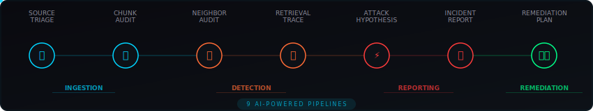
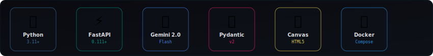

<div align="center">

<!-- Animated Header Banner -->
<a href="https://github.com/NitheshK4/RAG-Sentinel">
  
</a>

<br/>

<!-- Typing Animation -->
<a href="https://github.com/NitheshK4/RAG-Sentinel">
  
</a>

<br/><br/>

<!-- Badges Row -->
[](https://python.org)
[](https://fastapi.tiangolo.com)
[](https://ai.google.dev)
[](https://docs.pydantic.dev)
[](https://github.com/NitheshK4/RAG-Sentinel/actions/workflows/ci.yml)
[](LICENSE)

<br/>

<!-- Quick Stats -->


</div>

<!-- Wave Divider -->
<div align="center">
  
</div>

<br/>

> **RAG Sentinel** is a production-grade AI security analyst console that detects, investigates, and remediates vector index poisoning attacks in Retrieval-Augmented Generation pipelines — before they corrupt your AI's answers.

<br/>

## 🎯 The Threat: RAG Poisoning

<table>
<tr>
<td width="60%">

RAG systems retrieve documents from a vector index to ground LLM responses in real data. An attacker who can influence what gets indexed can **corrupt every downstream answer**.

RAG Sentinel is the security layer that catches all of these — **before and after indexing.**

</td>
<td width="40%">

```
    ╭──────────────╮
    │  📄 Poisoned  │
    │   Document    │──┐
    ╰──────────────╯  │
                      ▼
    ╭──────────────╮  ╭──────────╮
    │ 🔍 RAG       │──│ ⚠️ Wrong │
    │  Pipeline    │  │  Answer  │
    ╰──────────────╯  ╰──────────╯
           │
    ╭──────▼───────╮
    │ 🛡️ SENTINEL  │
    │   BLOCKS IT  │
    ╰──────────────╯
```

</td>
</tr>
</table>

### Attack Classes Detected

| | Attack Class | What It Does | Severity |
|---|---|---|---|
| 💉 | **Instruction Injection** | Embeds override commands inside policy documents to redirect LLM behavior | 🔴 Critical |
| 🎭 | **Authority Spoofing** | Claims false institutional authority to push malicious directives | 🔴 Critical |
| 🌊 | **Near-Duplicate Flooding** | Stuffs the index with near-identical poisoned chunks to dominate rankings | 🟠 High |
| 🌫️ | **Semantic Drift** | Subtly mutates factual content across a corpus to erode accuracy | 🟡 Medium |
| 🪤 | **Retrieval Bait** | Engineers chunks to rank highly for specific queries and hijack answers | 🟠 High |

<!-- Wave Divider -->
<div align="center">
  
</div>

## 🖥️ Live Demo

<div align="center">
  
  <br/><br/>
  <em>🔊 Dark glassmorphism console • 2D vector space visualizer • Red team ingestion simulator</em>
</div>

<!-- Wave Divider -->
<div align="center">
  
</div>

## ⚡ 9 AI-Powered Detection Pipelines

<div align="center">
  
</div>

<br/>

Each pipeline is a **Gemini-backed LLM analysis stage** with enforced structured JSON output via Pydantic v2 schemas.

<details>
<summary><b>📥 Ingestion Pipelines</b> — Catch threats at the gate</summary>
<br/>

| Pipeline | Endpoint | Purpose |
|---|---|---|
| Source Intake Triage | `POST /api/v1/ingestion/source-triage` | Assess trust signals, provenance, and poisoning risk of a new source |
| Chunk Semantic Audit | `POST /api/v1/ingestion/chunk-audit` | Inspect chunks for instruction injection, authority claims, and bait |

</details>

<details>
<summary><b>🔍 Detection Pipelines</b> — Investigate suspicious patterns</summary>
<br/>

| Pipeline | Endpoint | Purpose |
|---|---|---|
| Neighbor Consistency | `POST /api/v1/detection/neighbor-audit` | Check semantic consistency with adjacent chunks |
| Retrieval Trace | `POST /api/v1/detection/retrieval-trace` | Analyze retrieval traces for ranking domination |
| Attack Hypothesis | `POST /api/v1/detection/attack-hypothesis` | Synthesize evidence into analyst-verifiable poisoning theory |

</details>

<details>
<summary><b>📋 Reporting Pipelines</b> — Generate analyst-grade reports</summary>
<br/>

| Pipeline | Endpoint | Purpose |
|---|---|---|
| Incident Reporter | `POST /api/v1/reporting/incident-report` | Generate incident reports with confirmed findings and business impact |
| Remediation Planner | `POST /api/v1/reporting/remediation-plan` | Produce prioritized steps balancing speed and false-positive risk |

</details>

<details>
<summary><b>🧪 Evaluation Pipelines</b> — Red team and benchmark</summary>
<br/>

| Pipeline | Endpoint | Purpose |
|---|---|---|
| Attack Generator | `POST /api/v1/evaluation/attack-generator` | Synthesize novel payloads for red teaming |
| Benchmark Judge | `POST /api/v1/evaluation/benchmark-judge` | Score detector output against ground truth |

</details>

<!-- Wave Divider -->
<div align="center">
  
</div>

## ✨ Key Features

<table>
<tr>
<td align="center" width="25%">
<br/>
<h3>🖥️ Analyst Console</h3>
<p>Dark glassmorphism security dashboard with live telemetry, security health gauge, and ingestion timeline</p>
</td>
<td align="center" width="25%">
<br/>
<h3>🧪 Vector Visualizer</h3>
<p>Interactive 2D embedding space canvas with color-coded nodes — click any node to inspect similarity scores</p>
</td>
<td align="center" width="25%">
<br/>
<h3>🔴 Red Team Sim</h3>
<p>Step-by-step ingestion simulator with 3 presets: Clean, Authority Spoofing, and Instruction Injection</p>
</td>
<td align="center" width="25%">
<br/>
<h3>🤖 Smart Fallback</h3>
<p>No API key? No problem. Full demo mode with realistic analyst-grade mock responses for all pipelines</p>
</td>
</tr>
</table>

### 🧪 2D Vector Space — Color Legend

```
  ● Electric Cyan    → Clean policy reference chunks
  ● Vibrant Orange   → External / borderline-trust crawler chunks
  ● Glowing Red      → Active poisoning payloads
```

<!-- Wave Divider -->
<div align="center">
  
</div>

## 🏗️ Architecture

```
┌─────────────────────────────────────────────────────────────────────┐
│                          RAG  Sentinel                              │
│                                                                     │
│  ┌──────────────────────────────────────────────────────────────┐   │
│  │ Frontend SPA  (Vanilla JS + Canvas)                          │   │
│  │  Dashboard  ·  Pipelines  ·  Incidents  ·  Visualizer        │   │
│  └───────────────────────┬──────────────────────────────────────┘   │
│                          │ HTTP / REST                              │
│  ┌───────────────────────▼──────────────────────────────────────┐   │
│  │ FastAPI Backend                                              │   │
│  │                                                              │   │
│  │  Ingestion         Detection           Reporting             │   │
│  │  ├ source-triage   ├ neighbor-audit    ├ incident-report     │   │
│  │  └ chunk-audit     ├ retrieval-trace   └ remediation-plan    │   │
│  │                    └ attack-hypothesis                       │   │
│  │                                                              │   │
│  │  Evaluation        Orchestrator        Demo                  │   │
│  │  ├ attack-gen      └ /orchestrate      ├ /status             │   │
│  │  └ benchmark-judge                     ├ /incidents          │   │
│  │                                        └ /sample-*           │   │
│  │                                                              │   │
│  │  ┌─────────────────────────────────────────────────────┐    │   │
│  │  │ Core                                                │    │   │
│  │  │  config.py · prompt_loader.py · llm_client.py       │    │   │
│  │  └─────────────────────────────────────────────────────┘    │   │
│  └───────────────────────┬──────────────────────────────────────┘   │
│                          │                                          │
│  ┌───────────────────────▼──────────────────────────────────────┐   │
│  │ Gemini 2.0 Flash (via Google AI API)                         │   │
│  │ Graceful fallback → realistic demo JSON when rate-limited    │   │
│  └──────────────────────────────────────────────────────────────┘   │
└─────────────────────────────────────────────────────────────────────┘
```

<!-- Wave Divider -->
<div align="center">
  
</div>

## 🚀 Quickstart

### Prerequisites
- Python 3.11+
- A [Google AI API key](https://aistudio.google.com/apikey) *(optional — falls back to demo mode automatically)*

<table>
<tr>
<td>

### ⚡ Quick Run (3 commands)

```bash
# Clone
git clone https://github.com/NitheshK4/RAG-Sentinel.git
cd RAG-Sentinel

# Install
pip install -r requirements.txt

# Launch (demo mode — no API key needed!)
python3 -m uvicorn backend.main:app --host 0.0.0.0 --port 8000 --reload
```

</td>
<td>

### 🐳 Docker (1 command)

```bash
# Demo mode
docker compose up --build

# With Gemini API
GEMINI_API_KEY=your_key docker compose up --build
```

</td>
</tr>
</table>

**Open the dashboard** → [`http://localhost:8000`](http://localhost:8000)
**API docs** → [`http://localhost:8000/docs`](http://localhost:8000/docs)

> 💡 **Live inference mode:** Set `GEMINI_API_KEY=your_key_here` before launch to enable real-time Gemini-powered analysis.

<!-- Wave Divider -->
<div align="center">
  
</div>

## 📁 Project Structure

```
RAG-Sentinel/
├── backend/
│   ├── core/
│   │   ├── config.py           # Environment + path configuration
│   │   ├── llm_client.py       # Gemini API client with 429 fallback
│   │   └── prompt_loader.py    # In-memory embedded prompt templates
│   ├── models/                 # Pydantic v2 I/O schemas for all 9 pipelines
│   ├── routes/
│   │   ├── ingestion.py        # Source triage + chunk audit
│   │   ├── detection.py        # Neighbor audit + retrieval trace + hypothesis
│   │   ├── evaluation.py       # Attack generator + benchmark judge
│   │   ├── reporting.py        # Incident reporter + remediation planner
│   │   ├── orchestrator.py     # Single /orchestrate router endpoint
│   │   └── demo.py             # Sample data + persistent incident store
│   └── main.py                 # FastAPI app, CORS, SPA serving, error handlers
├── frontend/
│   ├── index.html              # 5-view SPA with ARIA navigation
│   ├── style.css               # Dark glassmorphism design system
│   ├── app.js                  # API calls, canvas visualizer, simulator engine
│   └── assets/                 # Animated SVG assets for documentation
├── schemas/                    # JSON Schema definitions for all 9 pipelines
├── examples/                   # Realistic sample data bundles for demo loading
└── requirements.txt
```

<!-- Wave Divider -->
<div align="center">
  
</div>

## 🔌 API Reference

All endpoints accept and return `application/json`. Interactive reference at `/docs`.

<details>
<summary><b>📥 Ingestion Endpoints</b></summary>

```http
POST /api/v1/ingestion/source-triage
```
Assess a source before it enters the pipeline. Returns risk classification, trust tier, and actionable flags.

```http
POST /api/v1/ingestion/chunk-audit
```
Inspect a single chunk for semantic poisoning signals. Returns threat category, confidence score, and evidence.

</details>

<details>
<summary><b>🔍 Detection Endpoints</b></summary>

```http
POST /api/v1/detection/neighbor-audit
```
Check a chunk against its neighbors for tone shifts, factual contradictions, and spoofed insertions.

```http
POST /api/v1/detection/retrieval-trace
```
Analyze a retrieval trace for ranking domination, query exploitation, and answer corruption.

```http
POST /api/v1/detection/attack-hypothesis
```
Synthesize all prior stage outputs into a single structured poisoning hypothesis.

</details>

<details>
<summary><b>📋 Reporting Endpoints</b></summary>

```http
POST /api/v1/reporting/incident-report
```
Generate a formal analyst incident report with confirmed scope and immediate action items.

```http
POST /api/v1/reporting/remediation-plan
```
Produce a prioritized remediation plan weighted against operational constraints.

</details>

<details>
<summary><b>🧪 Evaluation Endpoints</b></summary>

```http
POST /api/v1/evaluation/attack-generator
```
Generate synthetic attack payloads for red team exercises and benchmark creation.

```http
POST /api/v1/evaluation/benchmark-judge
```
Score detector output against ground truth labels and return precision/recall metrics.

</details>

<details>
<summary><b>💚 Health & Demo Endpoints</b></summary>

```http
GET  /api/v1/health                        → { status, version, demo_mode }
GET  /api/v1/health/ready                  → Readiness probe with dependency checks
GET  /api/v1/system/info                   → Runtime and config metadata
GET  /api/v1/demo/incidents                → Persistent in-memory incident log
POST /api/v1/demo/incidents                → Append incident to persistent store
GET  /api/v1/demo/incidents/{index}        → Single incident detail by index
POST /api/v1/demo/incidents/{index}/notes  → Add analyst note to an incident
GET  /api/v1/demo/sample-source-bundle     → Pre-built demo input bundle
GET  /api/v1/demo/sample-incident-report   → Pre-built demo incident report
```

</details>

<!-- Wave Divider -->
<div align="center">
  
</div>

## 🧰 Tech Stack

<div align="center">
  
</div>

<!-- Wave Divider -->
<div align="center">
  
</div>

## 🛡️ Design Principles

<table>
<tr>
<td>🎯</td>
<td><b>Single Responsibility</b></td>
<td>Every pipeline has one job. No prompt does more than one task.</td>
</tr>
<tr>
<td>🔒</td>
<td><b>Machine-Parseable Output</b></td>
<td>Pydantic v2 enforces the contract at every API boundary.</td>
</tr>
<tr>
<td>🔄</td>
<td><b>No Silent Failures</b></td>
<td>LLM client catches 429s and falls back to high-fidelity demo JSON. No blank screens.</td>
</tr>
<tr>
<td>📦</td>
<td><b>Self-Contained</b></td>
<td>All prompt templates embedded in memory. Clone and run — no external deps.</td>
</tr>
<tr>
<td>🧵</td>
<td><b>Concurrency Safe</b></td>
<td>In-memory stores are protected by <code>threading.Lock()</code>.</td>
</tr>
<tr>
<td>👤</td>
<td><b>Human-in-the-Loop</b></td>
<td>System flags findings but never takes destructive action automatically.</td>
</tr>
</table>

<!-- Wave Divider -->
<div align="center">
  
</div>

## ⚙️ Configuration

| Variable | Default | Description |
|---|---|---|
| `GEMINI_API_KEY` | `""` | Google AI API key. If empty, system runs in demo mode. |
| `RATE_LIMIT_RPM` | `120` | Max requests per minute per IP. |
| `RATE_LIMIT_BURST` | `20` | Burst allowance above RPM limit. |

> 💡 Demo mode returns realistic, analyst-grade mock responses for all 9 pipelines — fully usable for evaluation, demos, and local development without API quota.

<!-- Wave Divider -->
<div align="center">
  
</div>

## 🔧 Troubleshooting

<details>
<summary><b>Rate Limiting Errors (HTTP 429)</b></summary>

Encountering `HTTP 429 Rate Limit Exceeded`? Raise the limits for local development:
```bash
RATE_LIMIT_RPM=500 RATE_LIMIT_BURST=100 python3 -m uvicorn backend.main:app --reload
```

</details>

<details>
<summary><b>Static Asset Caching Issues</b></summary>

If frontend changes don't appear:
- Disable browser caching in developer tools
- Perform a hard reload (`Cmd+Shift+R` / `Ctrl+F5`)

</details>

<details>
<summary><b>LLM Connectivity Failures</b></summary>

If `/api/v1/health/ready` shows `llm_api` as `degraded`:
- Verify `GEMINI_API_KEY` is correctly set and exported
- Check outbound access to `generativelanguage.googleapis.com`

</details>

<!-- Wave Divider -->
<div align="center">
  
</div>

## 📜 License

MIT — see [LICENSE](LICENSE).

## 🤝 Contributing

Contributions are welcome! See [CONTRIBUTING.md](CONTRIBUTING.md) for guidelines.

---

<div align="center">

<br/>


<br/>

<a href="#"></a>

</div>
